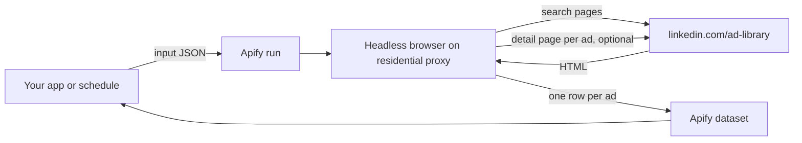

# LinkedIn Ad Library Scraper Docs

[](https://apify.com/agnes.developer.queen/linkedin-ad-library-scraper)
[](LICENSE)

Consumer documentation and integration examples for the LinkedIn Ad Library Scraper actor on Apify. The actor source is not in this repo. What you get here is the input and output shape, the exact pricing, and working curl, Node and Python snippets that call the public Apify API. The actor itself lives on Apify Store: https://apify.com/agnes.developer.queen/linkedin-ad-library-scraper

## What it does

You give it company names, keywords, payer names or pasted Ad Library search URLs. It returns every matching ad LinkedIn publishes in its public Ad Library as one row per ad: the copy, the picture or video, who paid for it, and the run dates, impressions range, impressions by country and targeting wherever LinkedIn publishes them. No LinkedIn account or cookies are involved; the actor reads the same pages anyone can open at linkedin.com/ad-library without signing in.

Two caveats. LinkedIn publishes run dates, impressions and targeting only for ads shown in the European Union; in a measured HubSpot run with no country filter, 28 of 40 ads carried them, and a US-only advertiser will have none. And LinkedIn never publishes spend, exact impression counts, clicks, or the specific companies and job titles targeted, so the actor cannot return them either.

Monitor mode (`onlyNewSinceLastRun`) remembers every ad a search has seen. Schedule the same input weekly and each later run delivers, and charges for, only the ads that appeared since.

## Architecture



## Request flow

```mermaid
sequenceDiagram
    participant App as Your App
    participant API as Apify API
    participant Actor as Ad Library Actor
    participant LI as LinkedIn Ad Library
    App->>API: POST /acts/agnes.developer.queen~linkedin-ad-library-scraper/run-sync-get-dataset-items
    API->>Actor: Start run with input
    Actor->>LI: Search by company, keyword, payer or URL
    LI-->>Actor: Result pages
    Actor->>LI: Detail page per ad (withDetails: true)
    LI-->>Actor: Payer, dates, impressions, targeting
    Actor->>Actor: Charge one Ad event per row with content
    Actor-->>API: Rows in dataset
    API-->>App: JSON array of ads
```

## Input

Every field is optional, but you need at least one of `companies`, `keywords`, `payers` or `startUrls`. Lists take up to 100 entries (`countries` up to 50).

| Field | Type | Default | What it does |
|---|---|---|---|
| `companies` | array | | Advertiser names as they appear on LinkedIn, for example `HubSpot` |
| `keywords` | array | | Words that appear in the ad, for example `webinar`. Each keyword is its own search |
| `payers` | array | | The entity that paid for the ads, when it differs from the advertiser |
| `startUrls` | array | | Search URLs copied from linkedin.com/ad-library/search, filters already set |
| `countries` | array | all | ISO two-letter codes such as `US`, `GB` or `DE`. `EU` is not a code and matches nothing; list member states instead |
| `dateOption` | string | `last-30-days` | `last-30-days`, `current-month`, `current-year`, `last-year` or `custom-date-range` |
| `startDate`, `endDate` | string | | For the custom range, YYYY-MM-DD |
| `minImpressions`, `maxImpressions` | integer | | Impressions bounds. Only EU-shown ads have impressions, so every other ad is dropped |
| `maxAdsPerSearch` | integer | 100 | Stop after this many ads per company, keyword, payer or URL, up to 5,000 |
| `withDetails` | boolean | true | Read each ad's detail page for payer, dates, impressions by country and targeting. Off, the run is about five times faster |
| `onlyNewSinceLastRun` | boolean | false | Monitor mode: later runs of the same search return only new ads |
| `proxyConfiguration` | object | Apify residential | The Ad Library blocks datacenter IPs |

The input used by every example in this repo, also in [examples/input.json](examples/input.json):

```json
{
    "companies": ["HubSpot"],
    "maxAdsPerSearch": 20,
    "proxyConfiguration": { "useApifyProxy": true, "apifyProxyGroups": ["RESIDENTIAL"] }
}
```

## Output shape

One full row from a real run on HubSpot, also in [examples/output.json](examples/output.json). Fields LinkedIn did not publish for an ad come back as `null`.

```json
{
    "adId": "1558773703",
    "adUrl": "https://www.linkedin.com/ad-library/detail/1558773703",
    "advertiserName": "HubSpot",
    "advertiserId": "68529",
    "advertiserType": "company",
    "advertiserUrl": "https://www.linkedin.com/company/68529",
    "payer": "HubSpot, Inc.",
    "adFormat": "Single Image Ad",
    "creativeType": "SPONSORED_STATUS_UPDATE",
    "text": "$1M to $100M ARR in 18 months. Stuart Shingler, Legora, on how fast-growth companies build trust while they innovate. London, 17 November.",
    "headline": "GROW Europe 2026 · London · Register Today",
    "description": null,
    "imageUrl": "https://media.licdn.com/dms/image/v2/D4D10AQGshA0JBhq0cA/image-shrink_1280/B4DaDP9g74HMAc-/0/1790195405027/2png?e=2147483647&v=beta&t=uu-v3Wv8B56hQBJAD5VjRRV3DN-EoRbg-UMe2X3kaSk",
    "images": [
        "https://media.licdn.com/dms/image/v2/D4D10AQGshA0JBhq0cA/image-shrink_1280/B4DaDP9g74HMAc-/0/1790195405027/2png?e=2147483647&v=beta&t=uu-v3Wv8B56hQBJAD5VjRRV3DN-EoRbg-UMe2X3kaSk"
    ],
    "videoUrl": null,
    "videoPosterUrl": null,
    "clickUrl": "https://www.hubspot.com/grow-europe?utm_source=linkedin&utm_medium=paid&utm_campaign=Marketing_Registrations_EN_EMEA_VARIOUS_GROW-Europe-2026_prospecting_cm1013_ProgramBudget_v1a&utm_id=805100113&hsa_acc=517582366&hsa_cam=805100113&hsa_grp=891556833&hsa_ad=1558773703&hsa_net=linkedin&hsa_ver=3",
    "messageSender": null,
    "callToAction": null,
    "firstShown": "2026-09-23",
    "lastShown": "2026-09-25",
    "totalImpressions": "5k-10k",
    "impressionsLow": 5000,
    "impressionsHigh": 10000,
    "impressionsByCountry": [
        { "country": "United Kingdom", "share": 91 },
        { "country": "Ireland", "share": 9 }
    ],
    "targeting": {
        "language": { "includes": ["English"], "excludes": [] },
        "location": { "includes": ["Ireland", "United Kingdom"], "excludes": [] },
        "parameters": [
            { "parameter": "Audience", "targeted": false, "excluded": true },
            { "parameter": "Demographic", "targeted": false, "excluded": false },
            { "parameter": "Company", "targeted": true, "excluded": true },
            { "parameter": "Education", "targeted": false, "excluded": false },
            { "parameter": "Job", "targeted": true, "excluded": false },
            { "parameter": "Member Interests and Traits", "targeted": false, "excluded": false }
        ]
    },
    "detailsRead": true,
    "search": "accountOwner \"HubSpot\"",
    "isNew": null,
    "charged": true,
    "reason": "ad with advertiser and content",
    "scrapedAt": "2026-09-25T12:12:10.512Z"
}
```

`videoUrl` holds the MP4 of a video ad, with `videoPosterUrl` as its poster frame. `messageSender` and `callToAction` are filled on Message Ads.

## Pricing

Pay per event. No subscription, no minimum.

| Event | Price | Charged when |
|---|---|---|
| Actor start | $0.00005 | once per run |
| Ad | $0.003 | an ad is delivered with its ID, its advertiser and its content (text, headline, picture or video) |

That is $3 per 1,000 ads. Worked example: 500 ads cost 500 x $0.003 = $1.50, plus $0.00005 for the start. Rows with no usable content are still delivered with `charged: false`, a `reason` and their `adUrl`, at no cost. The price is the same with or without detail pages. In monitor mode you pay only for ads new since the last run.

Apify's free plan includes $5 of monthly credit, which covers about 1,600 ads at this rate. Measured runs: 10 HubSpot ads in 44 seconds, 40 ads with detail pages in 117 seconds.

## Use cases

1. Competitor ad monitoring. Put three to ten competitors in `companies`, turn on monitor mode and schedule it weekly. Each run returns only ads that appeared since the last one.
2. Agency pitch decks. Open with the prospect's own LinkedIn ads, their run dates and the countries the impressions went to.
3. ABM messaging research. Read the copy and headlines a target account's vendors use, and which parameter groups (company, job, audience) they targeted.
4. Creative benchmarking. Build a swipe file for a category from keyword searches, with the picture or MP4 of each ad and its format.
5. Market-push analysis. LinkedIn does not publish spend, but `impressionsByCountry` and the impressions range show which EU markets a competitor pushes hardest.

## Examples

See [examples/curl.sh](examples/curl.sh), [examples/node.js](examples/node.js) and [examples/python.py](examples/python.py). Each one runs the actor with [examples/input.json](examples/input.json) and prints one line per ad. The curl script uses the synchronous `run-sync-get-dataset-items` endpoint, which waits for the run and returns the dataset in one response. The Node and Python scripts use `apify-client` and `actor().call()`, which is the better choice for runs over a few minutes.

Pass a company name as the first argument to search for someone other than HubSpot:

```
APIFY_TOKEN=... ./examples/curl.sh Salesforce
APIFY_TOKEN=... node examples/node.js Salesforce
APIFY_TOKEN=... python examples/python.py Salesforce
```

The actor is also available as an MCP tool at `https://mcp.apify.com/?tools=agnes.developer.queen/linkedin-ad-library-scraper`, and through the Apify app in Make, n8n and Zapier with the same JSON input.

## Authentication

You need an Apify API token. Get one at https://console.apify.com/account/integrations.

Set it as an environment variable:

```
APIFY_TOKEN=apify_api_xxxxxxxxxxxxxxxxxxxxx
```

The examples in this repo read from `APIFY_TOKEN`.

## Related actors

- [LinkedIn People Search Scraper](https://github.com/agnesthedeveloper/linkedin-people-search-scraper)
- [Google Ads Transparency Scraper](https://github.com/agnesthedeveloper/google-ads-transparency-scraper)
- [LinkedIn Jobs Scraper](https://github.com/agnesthedeveloper/linkedin-jobs-scraper)
- [LinkedIn Company Scraper](https://github.com/agnesthedeveloper/linkedin-company-scraper)
- [All actors](https://github.com/agnesthedeveloper/agnes-apify-actors), the hub repo

## Support

Found a bug, or need a field the output does not have? Open an issue on the actor's Issues tab on Apify Store: https://apify.com/agnes.developer.queen/linkedin-ad-library-scraper/issues

## License

MIT, see [LICENSE](LICENSE). The license covers the documentation and examples in this repo. The actor source is hosted on Apify and is not included here.
